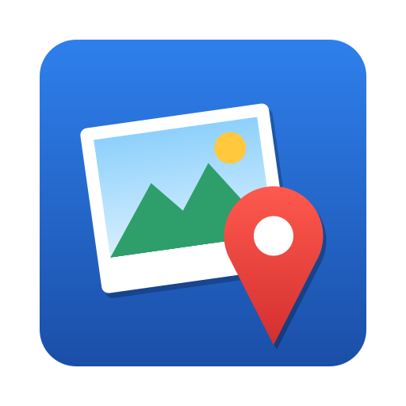
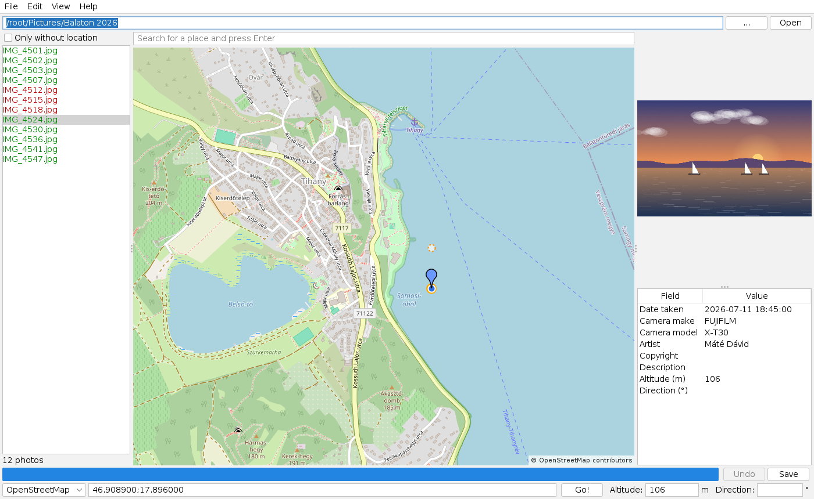
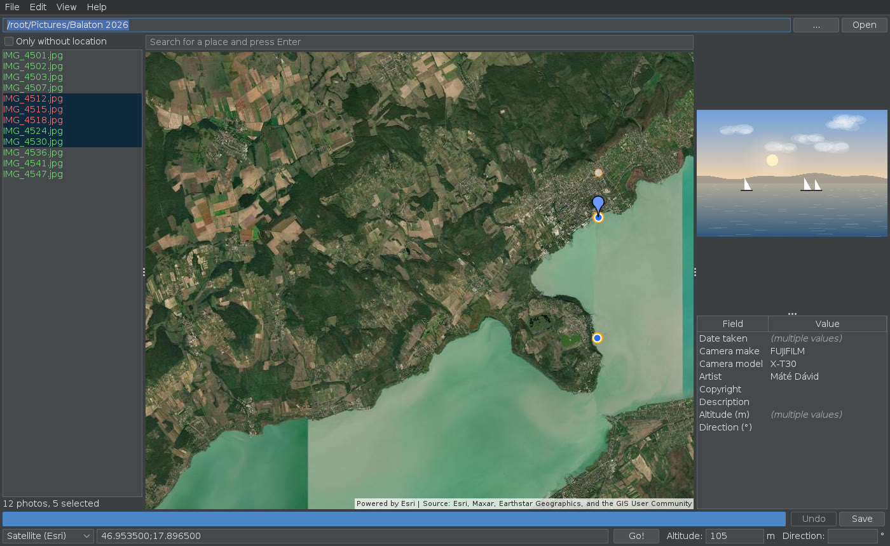
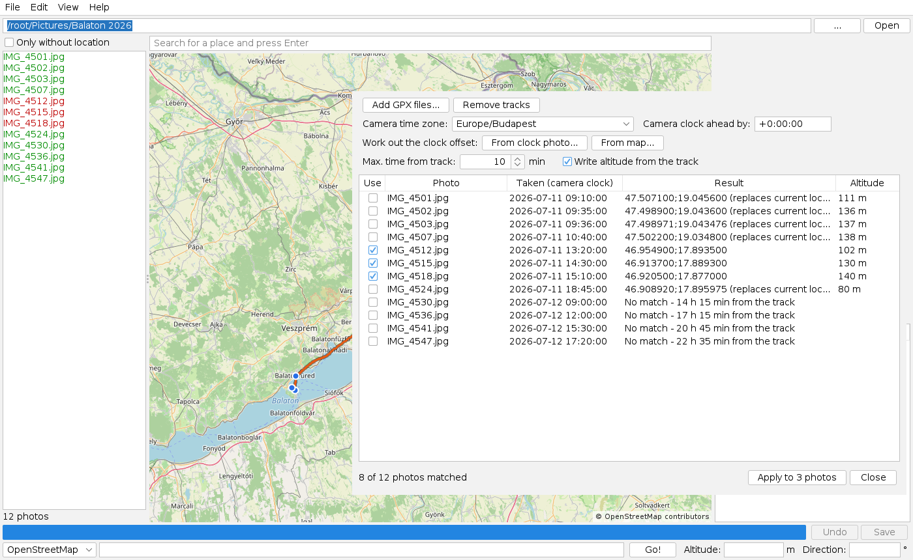
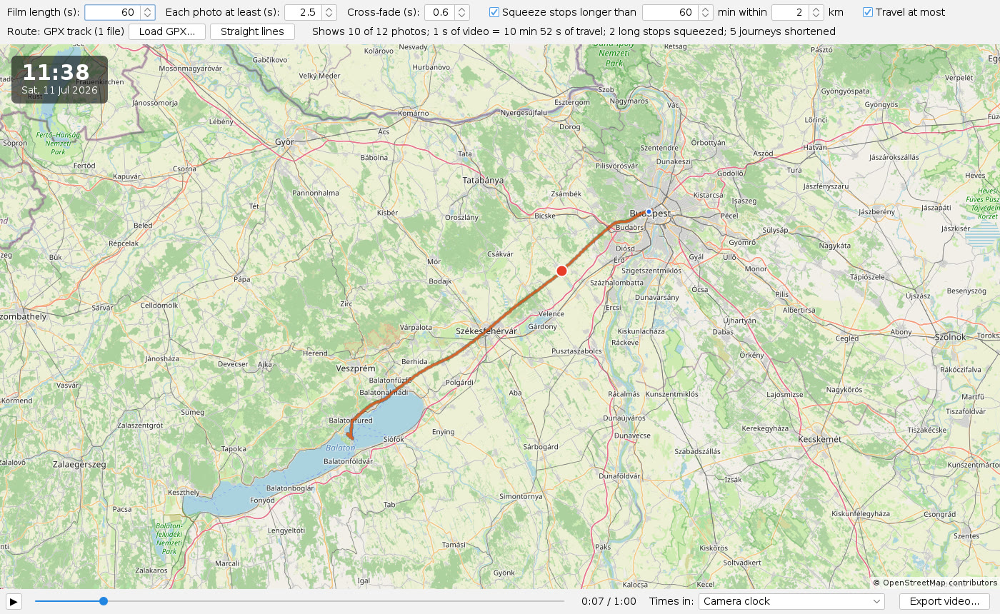
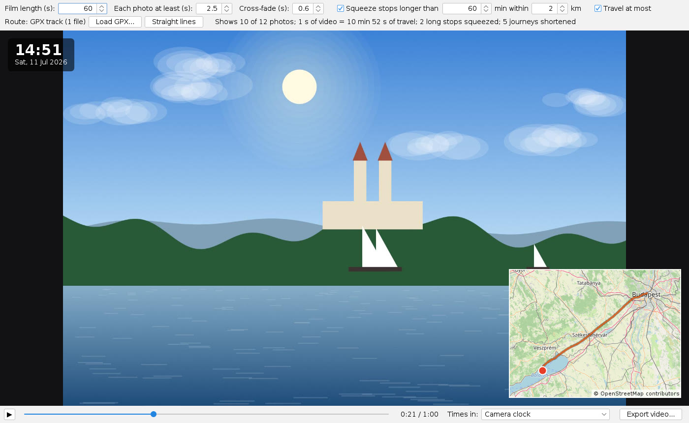
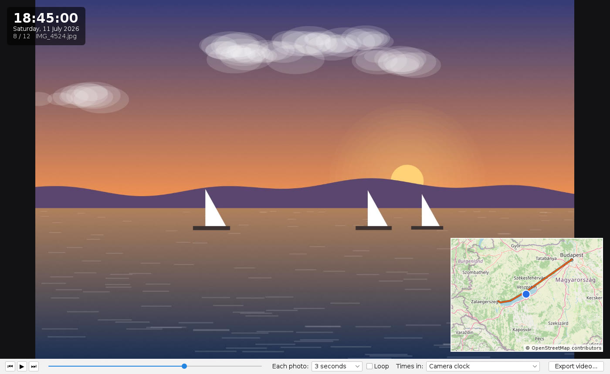
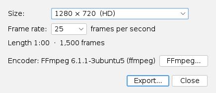

#  ExifTweaker

ExifTweaker puts your photos on the map: set where a photo was taken by clicking on a map, tag a whole folder at
once or from the GPX track your phone recorded, fix dates and other metadata, and play the trip back as a film.



## Download

Get the installer for your system from the [latest release](https://github.com/rothens/ExifTweaker/releases/latest).
It includes everything it needs; you don't have to install Java.

| System | File | Notes |
|--------|------|-------|
| Windows 10/11 | `ExifTweaker-<version>-windows-x64.msi` | Installs for all users (asks for administrator rights); you can pick the folder. |
| macOS (Apple silicon) | `ExifTweaker-<version>-macos-arm64.dmg` | The app isn't signed: the first time, right-click it in Applications and choose **Open**. |
| Linux (Debian, Ubuntu, Mint) | `exiftweaker_<version>_amd64.deb` | `sudo apt install ./exiftweaker_<version>_amd64.deb` |
| Anything with Java 17+ | `exiftweaker-<version>-all.jar` | `java -jar exiftweaker-<version>-all.jar` (also for Intel Macs) |

JPEG photos work out of the box. For **HEIC, PNG, TIFF, WebP and RAW** files also install the free
[ExifTool](https://exiftool.org/), and for faster video exports [FFmpeg](https://ffmpeg.org/download.html) (see
[Formats](#formats)).

## How to

New to ExifTweaker? On the first start a short **guided tour** walks you through tagging a photo, on a few sample
photos or on your own. It's always there again under **Help → Show tutorial**.

### Tag a photo

1. Open a folder: type its path at the top and press **Open**, or use **...** (File → Open folder, Ctrl+O).
   **File → Recent folders** has the last ten. Photos with a location are green in the list, the others are red;
   the **Thumbnails** tab shows them as small pictures, with a green or red dot.
2. Select a photo. Its thumbnail and metadata show on the right, and the map jumps to where it was taken.
3. Find the place: type a name in the search box above the map (e.g. `Tihany Abbey`) and press Enter, or drag and
   zoom the map.
4. **Right-click the exact spot.** Or type a coordinate into the field below the map (`46.9137;17.8893` or
   `46°54'49"N 17°53'21"E`) and press **Go!**
5. **Save** (Ctrl+S). Changed your mind? **Edit → Undo** (Ctrl+Z) puts the photos back the way they were.

Altitude and the direction the camera pointed can be entered next to the coordinate field and are saved along with
it. Drag the small handle next to the pin to set the direction on the map.

### Tag many photos at once

Select several photos (Shift- or Ctrl-click, or Edit → Select all photos, Ctrl+Shift+A), right-click the spot on
the map and press **Save**: the location goes to all of them, with a progress bar and a list of anything that
failed. Undo takes back the whole batch.

- **Drag photos onto the map**: drop them on the spot where they were taken, then Save.
- Tick **Only without location** to see just the photos that still need a location.
- **Copy and paste a location** from one photo to others: Ctrl+C and Ctrl+V on the photo list (or Edit → Copy
  location, Ctrl+Shift+C), then Save.
- **Edit → Remove location** strips the GPS data, e.g. before sharing photos online.



**View → Show photos on map** shows where the opened photos were taken (off by default). Photos close to each
other are grouped into one marker with a count; click a group to zoom in, or a photo to select it.

### Place names

When a location is saved, ExifTweaker also writes **where** that is in words: the city, town or village, the part
of it (e.g. *Namba* in Osaka), state and country, and a landmark when there is one, e.g. *Tihanyi bencés apátság,
Tihany, Veszprém, Magyarország*. The part of the city has no standard field, so it goes into ExifTweaker's own
(`XMP-exiftweaker:District`); the rest are the standard ones. Lightroom, digiKam, photo
sites and the photo's own details show these (IPTC/XMP location fields). The place shows in the details on the right
and in Play photos, Travel mode and their videos.

- **Edit → Look up place names** adds them to photos that already have a location: to the selected ones, or with
  none selected, to every photo that doesn't have a place name yet. Big batches tell you first how long they take.
- The names come from OpenStreetMap Nominatim, in your system's language. Each lookup is remembered, so photos
  close to one another (within 150 m) and later saves don't ask again; offline, the location is saved without the
  name and you can add it later.
- Removing a location removes the place name too. Turn it off in **Settings**.

### Rename photos

**Edit → Rename photos...** (F2) names the selected photos (or all of them) after when and where they were taken,
e.g. `{date} {place} {n:000}` gives `2026-07-11 Tihany 001.jpg`. The new names are listed before anything is renamed.

- Fields: `{date}` (or any format, e.g. `{date:yyyy-MM-dd HH.mm.ss}`), `{place}` (the city), `{district}`, `{country}`,
  `{state}`, `{sublocation}`, `{name}` (the current name), `{camera}` and `{n}`, a number in date order (`{n:000}`
  for three digits). A photo without a place simply leaves that part out.
- Nothing is ever overwritten: a name that is taken gets " (2)". Backups (`.bak`) and XMP sidecars are renamed
  along, and a RAW and a JPEG of the same shot keep sharing a name. **Edit → Undo** puts the old names back.

### Geotag from a GPX track

If your phone, watch or GPS logger recorded where you went, ExifTweaker can work out where each photo was taken
from the time it was taken.

1. Select the photos (or none, for all of them) and choose **File → Geotag from GPX** (Ctrl+G).
2. **Add GPX files...**: the track appears on the map.
3. Pick the **camera time zone** - the time zone the camera's clock was set to.
4. If the camera's clock was off, enter by how much, or let ExifTweaker work it out: **From clock photo...** (a photo
   of a clock showing the right time) or **From map...** (a photo whose location you know: right-click it on the
   map).
5. Check the list: each photo shows where it lands and its altitude from the track. Photos taken too far (by
   default 10 minutes) from any track point stay unmatched. Untick the ones you don't want and press **Apply**.



**No GPX file, but a phone?** Its photos know where they were taken. Press **Use photos with a location...** and pick
the photos of this folder that have one, or another folder (e.g. the phone's): the camera's photos are placed by time
between them. Phone photos are usually further apart than track points, so raise **Max. time** if photos stay
unmatched.

### Edit dates and other metadata

Double-click a value in the table on the right to change the **date taken, camera make and model, artist,
copyright, description, altitude or camera direction** - for one photo, or for all selected ones (values that
differ show as *(multiple values)* and are only written if you change them). Save writes them.

**Edit → Shift date/time** (Ctrl+T) moves the date taken of the selected photos, e.g. +1 h for a camera that was
left on home time during a trip.

### Play the trip back

- **View → Play photos** (F5) shows the photos one by one in the order they were taken, with the time and a small
  map following the route.
- **View → Travel mode** (Shift+F5) plays the trip as a short film of the length you choose: a marker travels the
  route (along your GPX track, if you loaded one) and each photo fades in as the marker arrives. Nights and other
  long stops are skipped over quickly, and longer journeys play on a full-screen map - or, with **Full-screen map
  between photos** off, the last photo stays up while the marker travels on the small map. Drag the small map's top
  left corner to resize it; zoom it with the mouse wheel. With **Small map follows the marker** it stays at the
  zoom you chose and keeps the marker in the middle, instead of showing the whole route.
- With place names, the clock shows where the photo was taken (*Osaka, Namba*), and while travelling where from
  and where to (*Osaka, Namba → Tokyo, Chiyoda*; **Show from → to**).
- Both can show the time as the camera recorded it or in any time zone (**Times in**), and **Export video...**
  saves them as an MP4 video, from 720p to 4K, also in portrait for phones.
- Right-click photos in the list for **Skip in trips** (left out of both, and of the videos) or **Prefer in trips**
  (shown first when travel mode can't fit every photo of a stretch). They're marked ⊘ and ★ in the list.

| Travel mode: on the road | Travel mode: arriving at a photo |
|---|---|
|  |  |



### Export

- **File → Export photos as GPX** (Ctrl+E) writes every photo with a location and a date as a waypoint, e.g. to show
  them in Google Earth.
- **Export video...** in the Play photos and Travel mode windows: pick the size and frame rate, and the video is made
  in the background.

  

### Share photos

**File → Export copies for sharing...** (Ctrl+Shift+E) saves copies of the selected photos (or all of them) into
another folder; the originals aren't touched.

- **Without location**: no GPS position and no place name; the date, camera and everything else stay.
- **Without any metadata**: only the picture, still shown the right way up (and in the same colors).
- **All metadata**: exact copies.
- Optionally **smaller** (from 4K down to 1024 px on the longest side) at the JPEG quality you choose; smaller copies
  and RAW files are saved as JPEG, turned upright. Copies at the original size keep the picture byte for byte.

## Formats

| Format | Location and metadata | Needs |
|--------|----------------------|-------|
| JPEG | Written into the photo | Nothing |
| HEIC/HEIF (iPhone), AVIF, PNG, TIFF, WebP | Written into the photo | [ExifTool](https://exiftool.org/) |
| RAW: CR2, CR3, NEF, NRW, ARW, DNG, ORF, RW2, RAF, PEF, ... | Written to an `.xmp` sidecar next to it; the RAW file is never changed. Lightroom, darktable, digiKam and most photo tools read it. | [ExifTool](https://exiftool.org/) |

When ExifTool isn't found, a banner at the top says which files need it; click it for the download link and to
pick the program if it isn't on your PATH. The same works for FFmpeg in the video export dialog and in Settings:
without it videos are made with a built-in encoder, which is slower and makes larger files.

Writing keeps everything else in the file as it was, including the camera maker's own data (maker notes); this is
tested on files from 16 cameras and phones and 6 RAW formats.

## Keyboard shortcuts

On macOS use Cmd instead of Ctrl.

| Main window | |
|---|---|
| Ctrl+O | Open folder |
| Ctrl+S | Save the location and metadata to the selected photos |
| Ctrl+Z | Undo the last save (a whole batch at once) |
| Ctrl+C / Ctrl+V on the photo list | Copy / paste a location |
| Ctrl+Shift+C / Ctrl+Shift+V | Copy / paste a location (from anywhere) |
| Ctrl+Shift+A | Select all photos |
| Ctrl+T | Shift date/time |
| F2 | Rename photos |
| Ctrl+G | Geotag from GPX |
| Ctrl+E | Export photos as GPX |
| Ctrl+Shift+E | Export copies for sharing |
| F5 | Play photos |
| Shift+F5 | Travel mode |
| Ctrl+, | Settings (on macOS: ExifTweaker → Settings) |
| Right-click on the map | Set the location |
| Mouse wheel, drag / arrow keys on the map | Zoom, move the map |

| Play photos and Travel mode | |
|---|---|
| Space | Play / pause |
| ← / → | Previous / next photo (Travel mode: 5 seconds back / forward) |
| Home / End | First / last photo (Travel mode: Home goes to the start) |
| Esc | Close the window |

## Settings and safety

- Before a photo is changed for the first time, a copy of the original is kept next to it as `<name>.bak` (can be
  turned off in Settings). Edit → Undo restores the last save without them.
- Light or dark theme (or following the system), OpenStreetMap or satellite imagery, the size of the map cache, and
  where ExifTool and FFmpeg are, in **Settings**.
- ExifTweaker goes online only for map tiles (OpenStreetMap, Esri), place search and place names (OpenStreetMap
  Nominatim: only the coordinates are sent). Your photos never leave your computer.

## Building from source

Requires Java 17+ and Maven.

```
mvn package
java -jar target/exiftweaker-*-all.jar
```

`src/main/packaging/jpackage.sh <version>` builds the installer for the system it runs on (needs JDK 17+; on
Windows also the WiX Toolset 3). Pushing a tag like `v1.0.0` builds all three in GitHub Actions and creates a draft
release with them.

See the [roadmap](ROADMAP.md) for what was built when.

## Credits

- [Apache Commons Imaging](https://commons.apache.org/proper/commons-imaging/) - reading and writing JPEG metadata
- [JXMapViewer2](https://github.com/msteiger/jxmapviewer2) - the map
- [FlatLaf](https://www.formdev.com/flatlaf/) - the look and feel
- [TwelveMonkeys ImageIO](https://github.com/haraldk/TwelveMonkeys) - WebP thumbnails
- [JCodec](http://jcodec.org/) - the built-in video encoder
- Optional, not bundled: [ExifTool](https://exiftool.org/) by Phil Harvey, [FFmpeg](https://ffmpeg.org/)
- Map data © [OpenStreetMap](https://www.openstreetmap.org/copyright) contributors; satellite imagery © Esri, Maxar,
  Earthstar Geographics and the GIS User Community
- The photos in the screenshots are drawn by a program; the places are real.

## License

[MIT](LICENSE) © Máté Dávid
